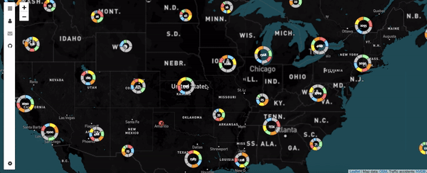

## Project Title

### ~~~ Graphy ~~~

## Motivation

We created this project as a way to cleanly display hundreds of thousands of tweets in a beautiful yet meaningful way so that users can understand certain trends in different regions around the world.

We are using Machine Learning models to parse through the tweets and classify them to a particular trend. Once we have tweets organized, we show them on a map and allow users to play with the sidebar to see different visualizations.

## Screenshots

## Tech/Framework Used

<b>Built with</b>
- [Leaflet](http://leafletjs.com/)
- [Kafka](https://kafka.apache.org/)
- [Cassandra](http://cassandra.apache.org/)
- [Docker](https://www.docker.com/)
- [Twitter API](https://developer.twitter.com/)
- [Kubernetes](https://kubernetes.io/)
- [D3](https://d3js.org/)

## Infrastructure

Check out our [infrastructure repository](https://github.com/CUBigDataClass/graphy-kubernetes) and our [backend repository](https://github.com/CUBigDataClass/graphy-backend). 

## Logo

[Network by Barracuda from the Noun Project](https://thenounproject.com/search/?q=network&i=739907)

## License

MIT © Graphy
